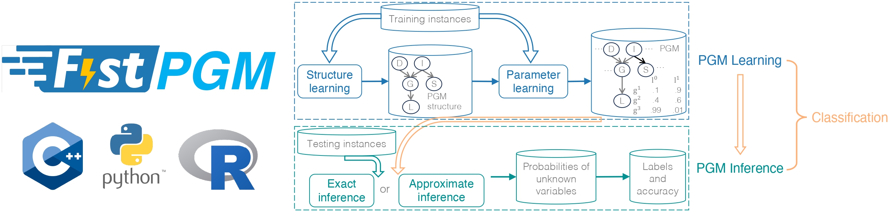

<div align="center">
<h1>FastPGM: Fast Probabilistic Graphical Model Learning and Inference</h1>

<!-- </div>
<div align="center">
<b><a href="https://jjiantong.github.io/">Jiantong Jiang</a></b><sup>1</sup>,
</div>
<div align="center">
<sup>1</sup>The University of Melbourne
</div> -->



[**Documentation**](https://fastpgm.readthedocs.io/en/latest/index.html) 
| [**Parameters**](https://fastpgm.readthedocs.io/en/latest/param_toc.html) 
| [**Knowledge base**](https://fastpgm.readthedocs.io/en/latest/basic_toc.html)
| [**Python interface**](https://fastpgm.readthedocs.io/en/latest/python_toc.html)

**Fast-PGM** is an open-source C++ library that aims to help practitioners easily and efficiently 
apply probabilistic graphical models (PGMs) to solve real-world problems. FastBN exploits multi-core CPUs 
to achieve high efficiency. Key features of FastBN are as follows:
- Wide coverage of different tasks and algorithms related to PGMs, including structure learning 
(PC-stable), parameter learning (maximum likelihood estimation), exact inference (junction tree, 
variable elimination, brute force), and approximate inference (loopy belief propagation, 
probabilistic logic sampling, likelihood weighting, self-importance sampling, AIS-BN, EPIS-BN).
- Support classification, through the building blocks of structure learning, parameter learning 
and inference.
- Support Python interfaces.
- Support BN sample generation, dataset and network format convertor, etc.


## Installation

Clone this repository and build. The recommended option for most users are as follows. Our full installation guide is 
available in our documentation.
```
git clone --recursive https://github.com/jjiantong/FastPGM.git
cd FastPGM
# under the directory of FastPGM
mkdir build && cd build && cmake -DCMAKE_BUILD_TYPE=Release .. && make
```

[//]: # (On Mac OS, the default compiler &#40;clang&#41; needs to be changed to g++. &#40;You can use ```ls /usr/local/bin | grep g++``` to check the compiler. Mine is ```g++-9```.&#41;)

[//]: # (```)

[//]: # (mkdir build)

[//]: # (cd build)

[//]: # (cmake -DCMAKE_CXX_COMPILER=g++-9 -DCMAKE_BUILD_TYPE=Release -DUSE_MPI=OFF ..)

[//]: # (make)

[//]: # (```)

## Quick Start

Run FastPGM through executable.
```
# under the directory of FastPGM/build
./BayesianNetwork
```
By default settings, Fast-PGM will run the structure learning job using the PC-Stable method with one
thread (the sequential version) on 5000 samples generating from the ALARM BN. Command line options
can be used to specify the job, method and corresponding parameters, see 
[**Parameters**]((https://fastpgm.readthedocs.io/en/latest/param_toc.html)).


## Citation

If you find FastPGM useful, please consider citing our papers.

Fast-BNS in IPDPS 2022:
```
@inproceedings{jiang2022fast,
  title={Fast Parallel Bayesian Network Structure Learning},
  author={Jiang, Jiantong and Wen, Zeyi and Mian, Ajmal},
  booktitle={2022 IEEE International Parallel and Distributed Processing Symposium (IPDPS)},
  pages={617--627},
  year={2022}
}
```

Fast-BNS-v2 in TPDS (2024):
```
@article{yang2024parallel,
  title={Parallel and Distributed Bayesian Network Structure Learning},
  author={Yang, Jian and Jiang, Jiantong and Wen, Zeyi and Mian, Ajmal},
  journal={IEEE Transactions on Parallel and Distributed Systems},
  year={2024},
  volume={35},
  number={4},
  pages={517-530}
}
```

Fast-BNI in PPoPP 2023:
```
@inproceedings{jiang2023fast,
  title={Fast Parallel Exact Inference on Bayesian Networks},
  author={Jiang, Jiantong and Wen, Zeyi and Mansoor, Atif and Mian, Ajmal},
  booktitle={Proceedings of the 28th ACM SIGPLAN Annual Symposium on Principles and Practice of Parallel Programming},
  pages={425--426},
  year={2023}
}
```

Faster-BNI in TPDS (2024):
```
@article{jiang2024faster,
  title={Faster-BNI: Fast Parallel Exact Inference on Bayesian Networks}, 
  author={Jiang, Jiantong and Wen, Zeyi and Mansoor, Atif and Mian, Ajmal},
  journal={IEEE Transactions on Parallel and Distributed Systems},
  year={2024},
  volume={35},
  number={8},
  pages={1444-1455}
```

Fast-PGM (inference only) in USENIX ATC 2024:
```
@inproceedings{jiang2024fast,
  title={Fast inference for probabilistic graphical models},
  author={Jiang, Jiantong and Wen, Zeyi and Mansoor, Atif and Mian, Ajmal},
  booktitle={2024 USENIX Annual Technical Conference (USENIX ATC 24)},
  pages={95--110},
  year={2024}
}
```

Fast-PGM (the library): 
```
@article{jiang2024fastpgm,
  title={Fast-PGM: Fast Probabilistic Graphical Model Learning and Inference},
  author={Jiang, Jiantong and Wen, Zeyi and Yang, Peiyu and Mansoor, Atif and Mian, Ajmal},
  journal={arXiv preprint arXiv:2405.15605},
  year={2024}
}
```


## Dependency
 * [GoogleTest](https://github.com/google/googletest)
 * [TinyXML2](https://github.com/leethomason/tinyxml2)
 * [ARFF](https://github.com/LinjianLi/ARFF)
 * [StasLib](https://github.com/jjiantong/stats)
 * [GCE-Math](https://github.com/kthohr/gcem)
 * [pybind11](https://github.com/pybind/pybind11)

