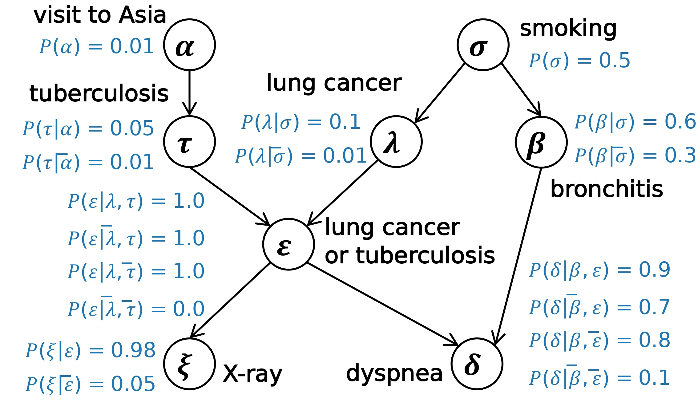

BNs
===

Bayesian Networks (BNs) are a class of graphical models that represent a joint distribution over a set of random
variables :math:`\mathcal{V} = \{V_0, V_1, ... , V_{n-1}\}` via a directed acyclic graph (DAG). Typically, one variable
corresponds to one feature in the machine learning problems.

+------------------------------------------------------+
| |BN|                                                 |
+======================================================+
| An example BN named Asia. :math:`x` is short for     |
| :math:`x=1` while :math:`\overline{x}` is short for  |
| :math:`x=0`, where :math:`x` represents any variable |
| in the BN.                                           |
+------------------------------------------------------+

A BN is defined as :math:`B = (\mathbb{G}, \mathbb{P})`, where :math:`\mathbb{G} = (\mathcal{V}, \mathcal{E})` is a DAG
and :math:`\mathbb{P}` is the parameters of the network. The figure above illustrates the DAG :math:`\mathbb{G}` of the
Asia network with eight (0,1)-valued variables and eight edges. Each node in :math:`\mathcal{V}` is associated with one
variable and each edge in :math:`\mathcal{E}` indicates conditional dependency between two variables. :math:`V_j` is
called a parent of :math:`V_i` if there exists a directed edge from :math:`V_j` to :math:`V_i` in :math:`G`, and we use
:math:`\textbf{Par}(V_i)` to denote the set of parent variables of :math:`V_i`. For example, variable :math:`\sigma` is
the parent of variable :math:`\lambda`; the direct edge between them indicates whether smoking impacts the likelihood
of a patient suffering from lung cancer.

The parameter set :math:`\mathbb{P}` represents a set of conditional probability distributions (CPDs) that describes the
probability of possible values of each variable given its possible parent configurations. The joint probability of BN
can be decomposed into the product of the CPDs of each variable:

.. math::

    P(\mathcal{V}) = P(V_0, V_1, ...,V_{n-1}) = \prod_{i=0}^{n-1} P(V_i | \textbf{Par}(V _i))

where :math:`n` is the number of variables, :math:`P(V_0, V_1, ...,V_{n-1})` is the joint probability, and
:math:`P(V_i | Pa(V_i))` is the CPD of variable :math:`V_i`. Each local CPD depends only on a single variable
:math:`V_i` and its parents.

BN Structure Learning
=====================

introduce bnsl

PC-Stable
---------

introduce pc-stable

Inference on BNs
================

introduce inference

Exact Inference
---------------

introduce bnei

Variable Elimination
~~~~~~~~~~~~~~~~~~~~

introduce ve

Junction Tree
~~~~~~~~~~~~~

introduce jt

Approximate Inference
---------------------

introduce approximate inference

Probabilistic Logic Sampling
~~~~~~~~~~~~~~~~~~~~~~~~~~~~

introduce pls

Likelihood Weighting
~~~~~~~~~~~~~~~~~~~~

introduce lw

Self-importance Sampling
~~~~~~~~~~~~~~~~~~~~~~~~

introduce sis

AIS-BN
~~~~~~

introduce aisbn

EPIS-BN
~~~~~~~

introduce episbn