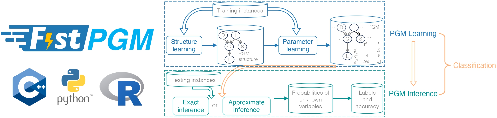

.. FastPGM documentation master file, created by
   sphinx-quickstart on Tue Mar 26 23:54:38 2024.
   You can adapt this file completely to your liking, but it should at least
   contain the root `toctree` directive.

FastPGM: Fast Probabilistic Graphical Model Learning and Inference
==================================================================

**FastPGM** is an open-source C++ library that aims to help practitioners easily and efficiently apply probabilistic
graphical models (PGMs), especially Bayesian network (BN) models to solve real-world problems. FastPGM exploits
multi-core CPUs to achieve high efficiency. Key features of FastPGM are as follows:

* Wide coverage of different tasks and algorithms related to PGMs, including structure learning, parameter learning, exact inference and approximate inference.
* Support classification, through the building blocks of structure learning, parameter learning and inference.
* Support Python interfaces.
* Support PGM sample generation, dataset and network format convertor, etc.

.. toctree::
   :name: Getting Started
   :caption: Getting Started
   :maxdepth: 3

   installation
   first_example
   support
   citing
   dependency

.. toctree::
   :name: Next Steps
   :caption: Next Steps
   :maxdepth: 3

   param_toc
   python_toc

.. toctree::
   :name: Knowledge Base
   :caption: Knowledge Base
   :maxdepth: 3

   basic_toc
   faq_toc

.. Indices and tables
.. ==================
..
.. * :ref:`genindex`
.. * :ref:`modindex`
.. * :ref:`search`
