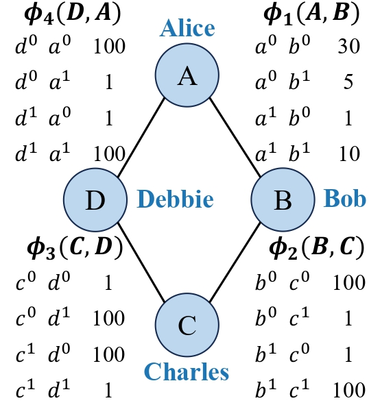

Probabilistic Graphical Model
=============================

Probabilistic graphical models (PGMs) are defined by :math:`\mathbb{G}` and :math:`\mathbb{P}`, where
:math:`\mathbb{G} = (\mathcal{V}, \mathcal{A})` is the structure of the graphical model and :math:`\mathbb{P}` is the
parameters of the model. The nodes :math:`\mathcal{V} = \{V_0, V_1, ... , V_{n-1}\}` in :math:`\mathbb{G}` denote the
*random variables* and the edges :math:`\mathcal{A}` denote the probabilistic interactions among the variables.
Typically, one random variable corresponds to one feature in the machine learning problems.

The advantages of PGMs lie in their clear and intuitive representation and rigorous mathematical foundation. They have
found practical applications in broad domains like biomedical informatics, computer vision, environmental monitoring,
risk management and transportation.

.. note::
   FastPGM focuses specifically on discrete PGMs, where the random variables take on a finite set of discrete values.

Bayesian Network
----------------

Bayesian networks (BNs) are a pivotal type of PGMs. In a BN, :math:`\mathbb{G}` is a directed acyclic graph (DAG),
where each node in :math:`\mathcal{V}` is associated with one variable and each edge in :math:`\mathcal{A}` represents
conditional dependencies among the two variables. :math:`V_j` is called a *parent* of :math:`V_i` if there exists a
directed edge from :math:`V_j` to :math:`V_i` in :math:`\mathbb{G}`. We use :math:`\textbf{Par}(V_i)` to denote the set
of parent variables of :math:`V_i`.

The figure below illustrates the DAG :math:`\mathbb{G}` of the Asia network with eight (0,1)-valued variables and eight
edges. In this example, variable :math:`\sigma` is the parent of variable :math:`\lambda`; the direct edge between them
indicates whether smoking impacts the likelihood of a patient suffering from lung cancer. In BNs, the variables
influencing :math:`V_i` are exactly its parents :math:`\mathbf{Par}(V_i)`.

.. _fig_bn:

.. figure:: fig/fig_bn.jpg
   :width: 400
   :alt: An example Bayesian network

   An example Bayesian network named Asia. :math:`x` is short for :math:`x=1` while :math:`\overline{x}` is short for
   :math:`x=0`, where :math:`x` represents any variable in the BN.

The parameter set :math:`\mathbb{P}` in a BN is a set of *conditional probability distributions (CPDs)*. Each CPD
describes the probability distribution of possible values of a variable given its possible parent configurations.
For example, according to the CPD of :math:`\xi`, the probability of having an abnormal X-ray result is 0.98 for
individuals diagnosed with lung cancer or tuberculosis and 0.05 for those without these conditions.

The overall joint probability of variables :math:`\mathcal{V}` in a BN can be decomposed into the product of the local
CPDs of each variable, and each local CPD depends only on a single variable :math:`V_i` and its parents:

.. math::

    P(\mathcal{V}) = P(V_0, V_1, ...,V_{n-1}) = \prod_{i=0}^{n-1} P(V_i | \mathbf{Par}(V_i)),

where :math:`n` is the number of random variables, and :math:`P(V_i | \mathbf{Par}(V_i))` is the CPD of :math:`V_i`.

.. important::
   **Key advantages of BNs:** 1. BNs are represented by DAGs, where the directionality of edges captures causal
   relationships between variables. This feature makes BNs particularly advantageous in real-world complex scenarios
   where cause-and-effect relationships are prevalent. It also makes BNs suitable for areas where interpretability is
   crucial. 2. The flexibility of BNs in integrating prior knowledge is another critical advantage. The ability to
   incorporate domain-specific knowledge through prior distributions enhances the model's robustness and performance.

Markov Random Field
-------------------

Markov random fields (MRFs) are another subclass of PGMs. The major difference is that the structure :math:`\mathbb{G}`
of an MRF is an undirected graph. The absence of directed edges in the MRF implies that there is no inherent
directionality in the relationships between variables; instead, the dependencies are symmetric and bidirectional.

The parameters :math:`\mathbb{P}` of an MRF is a set of *potential functions*. Each potential function
:math:`\phi_c(\mathcal{V}_c)` defines a joint distribution over a set of variables
:math:`\mathcal{V}_c \subseteq \mathcal{V}`, capturing the strength of the interaction of all the variables within
:math:`\mathcal{V}_c`. A set :math:`\mathcal{V}_c` is called a *clique* in MRFs, which is a fully connected subset,
where every pair of nodes within the clique is connected by an edge. The figure below shows a simple MRF with four
nodes and four edges. In this example, the cliques are the edges themselves.

.. _fig_mrf:

   A simple example Markov random field.

The overall joint distribution of an MRF can be factorized into a product of potential functions over the cliques of
the graph:

.. math::

    P(\mathcal{V}) = P(V_0, V_1, ...,V_{n-1}) = \frac{1}{Z} \prod_{c} \phi_c(\mathcal{V}_c),

where the term :math:`Z` is the partition function, which is a normalization constant that ensures the joint probability
distribution sums to one.

In fact, we can also get the CPD :math:`P(V_i | \mathbf{C}(V_i))` of :math:`V_i` via the potential functions:

.. math::

    P(V_i|\mathbf{C}(V_i)) = \frac{P(V_i, \mathbf{C}(V_i))}{P(\mathbf{C}(V_i))} = \frac{\prod_{c \in \mathbb{P}_{\{V_i\} \cup \mathbf{C}(V_i)}} \phi_c(\mathcal{V}_c)}{\sum_{v_i} \prod_{c \in \mathbb{P}_{\{V_i\} \cup \mathbf{C}(V_i)}} \phi_c(\mathcal{V}_c)}.

We define the concept :math:`\mathbf{C}(V_i)` as *conditioning set*, which means the variables influencing
:math:`V_i` in :math:`\mathbb{G}`. Recall that :math:`\mathbf{C}(V_i)` is exactly :math:`\mathbf{Par}(V_i)` in BNs;
while in the context of MRFs, :math:`\mathbf{C}(V_i)` is the *Markov blanket* of :math:`V_i`.

The core of the formula is to multiply all the potential functions that are related to
:math:`\{V_i\} \cup \mathbf{C}(V_i)` and sum over all possible values of :math:`V_i`. This computation allows for a
unified perspective on BNs and MRFs, which is useful for the tasks on PGMs.

.. important::
   The conditioning set :math:`\mathbf{C}(V_i)` encompasses both the parents of :math:`V_i` in the context of BNs and
   the Markov blanket of :math:`V_i` in the context of MRFs, which is important for a unified perspective on PGMs.

